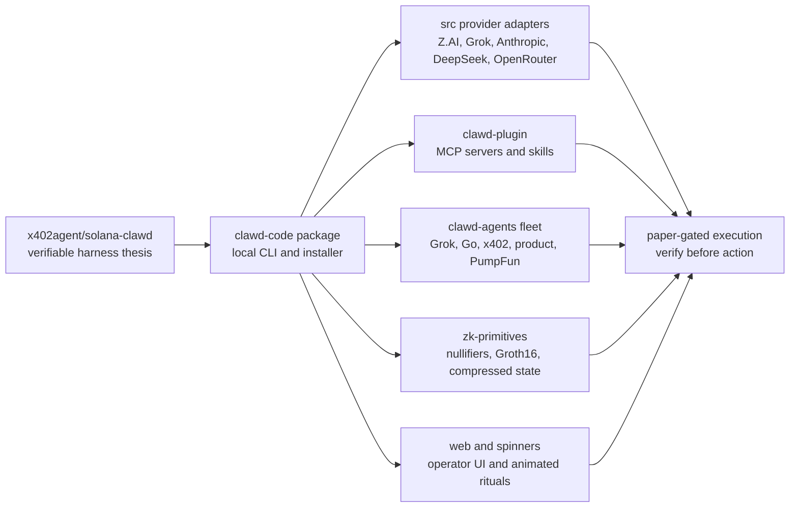

<div align="center">


[](https://www.npmjs.com/package/@solana-clawd/clawd-code)
[](./LICENSE)
[](#install)
[](#solana-harness)

</div>

## What This Is

Clawd Code is a curl-installable, Solana-native AI coding harness. It is not a
single chatbot wrapper. It is a local operator loop that can route work across
model providers, create and inspect wallets, reason about Solana state, run
paper-gated perpetuals workflows, speak through voice mode, render image and
slide prompts, relay through Telegram, install animated spinner packs, and plug
into MCP servers for live chain tooling.

The shape of the harness is the point:

```text
intent
  -> provider route
  -> model route
  -> tool route
  -> simulate / inspect
  -> human or paper gate
  -> execute
  -> verify
  -> remember what happened
```

The origin spark is
[x402agent/solana-clawd](https://github.com/x402agent/solana-clawd), whose
README frames Clawd as a verifiable agentic harness rather than a probabilistic
answer box. This checkout turns that thesis into the `clawd-code` package,
the plugin bundle, the Grok/Z.AI/OpenRouter provider stack, the x402 commerce
surface, the ZK primitive layer, and the local operator docs that live in this
repository today.

## Install

```bash
curl -fsSL https://raw.githubusercontent.com/Solizardking/clawd-code/main/install.sh | sh
```

The installer checks for Node.js 18+, installs the `clawd-code` binary, and
creates `~/.clawd-code/.env` if one does not already exist. The xAI Voice Agent
mode needs Node.js 22+ for native WebSocket support.

Product page: [cheshireterminal.ai/clawdcode](https://cheshireterminal.ai/clawdcode)
(also available at `/clawd-code`).

Smoke-test this exact checkout without linking a global binary:

```bash
CLAWD_CODE_SOURCE_DIR=/Users/8bit/clawd-code \
CLAWD_CODE_CONFIG_DIR=/tmp/clawd-code-smoke-home/.clawd-code \
CLAWD_CODE_SMOKE_TEST=true \
sh /Users/8bit/clawd-code/install.sh
```

Manual install:

```bash
git clone https://github.com/Solizardking/clawd-code.git
cd clawd-code
cp .env.example ~/.clawd-code/.env
npm install
npm run build
npm link
```

## First Spell

```bash
clawd-code code "Build a Jupiter swap monitor in TypeScript"
clawd-code wallet create
clawd-code chain status
clawd-code chain ask "what should I inspect before touching this program?"
clawd-code trade "funding rate on SOL perps"
clawd-code chart "analyze this SOL chart" --image ./chart.png
clawd-code research --agents 16 "Solana perps funding arb"
clawd-code image "cyberpunk Solana trading desk"
clawd-code slides "weekly Solana market report" --pages 6
clawd-code repl
clawd-code arena status
clawd-code spinner list
clawd-code spinner install wizard
TELEGRAM_BOT_TOKEN=... TELEGRAM_ALLOWED_CHAT_ID=... clawd-code telegram
```

## Provider Constellation

Clawd Code has provider routing and model routing built into `src/`. The
operator can set a default provider, override the model per run, or use slash
commands and mode-specific defaults.

| Provider | Adapter | Typical role |
| --- | --- | --- |
| Z.AI | `src/zai.ts` | Default coding/chat/vision/image/slide path in this checkout |
| xAI / Grok | `src/xai.ts`, `src/grok-models.ts` | Grok-family chat, trading, and voice workflows |
| Anthropic | `src/anthropic.ts` | Optional Claude-family coding route |
| DeepSeek | `src/deepseek.ts` | Optional coding and reasoning route |
| OpenRouter | `src/openrouter.ts` | Nemo and Fable aliases without a sidecar package |
| Custom OpenAI-compatible | Grok harness support | Bring your own base URL, API key, and model |

Core knobs:

```bash
CLAWD_PROVIDER=zai
CLAWD_MODEL=glm-5.2
ZAI_API_KEY=...
XAI_API_KEY=...
ANTHROPIC_API_KEY=...
DEEPSEEK_API_KEY=...
OPENROUTER_API_KEY=...
OPENAI_API_KEY=...
OPENAI_BASE_URL=https://api.openai.com/v1
```

OpenRouter Nemo/Fable aliases are part of the CLI source:

```bash
OPENROUTER_NEMO_MODEL1=nvidia/nemotron-3-ultra-550b-a55b:free
OPENROUTER_NEMO_MODEL2=nvidia/nemotron-3-ultra-550b-a55b
OPENROUTER_NEMO_MODEL3=nvidia/nemotron-3-super-120b-a12b:free
OPENROUTER_FABLE5=anthropic/claude-fable-5
OPENROUTER_FABLE_LATEST=~anthropic/claude-fable-latest
# Current adapter also accepts the legacy typo:
OPENROUTER_FABLE_LATESY=~anthropic/claude-fable-latest
```

## Command Matrix

| Command | Purpose |
| --- | --- |
| `clawd-code code "<prompt>"` | Generate TypeScript/Solana code; add `--stream` for streaming |
| `clawd-code trade "<intent>"` | Analyze perps, funding, paper positions, and risk gates |
| `clawd-code perps` / `funding` | Shortcut market views |
| `clawd-code chart "<prompt>" --image file.png` | Vision-assisted chart review |
| `clawd-code chain status` | Read-first Solana RPC status |
| `clawd-code chain balance <wallet>` | Wallet balance inspection |
| `clawd-code chain ask "<question>"` | Solana-aware Q&A with RPC context |
| `clawd-code wallet create` / `wallet list` | Local keypair management |
| `clawd-code research --agents N "<topic>"` | Multi-agent research fanout |
| `clawd-code image "<prompt>"` | Image prompt mode through configured provider |
| `clawd-code slides "<topic>" --pages N` | Slide-outline generation |
| `clawd-code repl` | Interactive operator loop |
| `clawd-code arena status` | Agent Arena identity/status |
| `clawd-code spinner list/install <pack>` | Install local animated spinner packs |
| `clawd-code telegram` | Single-chat Telegram relay for chat/CLI commands |

Inside the REPL, slash commands map to the same surfaces:

```text
/wallet create
/chain status
/perps
/funding
/chart ./chart.png
/arena status
/goal "ship a Solana verifier"
/help
```

## The Story So Far



1. **Origin**: `x402agent/solana-clawd` established the thesis that useful AI
   agents need harnesses, receipts, constrained tools, payments, and audit
   trails.
2. **Package**: `/Users/8bit/clawd-code` packages that thesis as
   `@solana-clawd/clawd-code`, with `install.sh`, `package.json`,
   `package-lock.json`, `tsconfig.json`, and a Node 18+ CLI build.
3. **Providers**: `src/` gives the operator provider routing and model routing
   across Z.AI, Grok, Anthropic, DeepSeek, OpenRouter, and OpenAI-compatible
   endpoints.
4. **Plugin**: `clawd-plugin/` wraps the harness as skills and MCP servers so
   agent runtimes can reach Helius, Pump, Phoenix, DFlow, ZK compression, and
   the Clawd Code CLI.
5. **Fleet**: `clawd-agents/` adds specialized agents: Grok CLI, Go SDK,
   product registration, x402 gateway, and PumpFun copy-trading work.
6. **Proof Layer**: `zk-primitives/` sketches the receipt spine: nullifiers,
   proof verification, and compressed state.
7. **Operator Surface**: `web/`, `spinners/`, `SOUL.md`, `IDENTITY.md`,
   `CLAWD.md`, `agent.md`, and `Skill.md` make the harness usable by humans and
   agent runtimes.

## Repository Star Chart

Canonical local root: `/Users/8bit/clawd-code`.

| Path | Status | Role |
| --- | --- | --- |
| `/Users/8bit/clawd-code/README.md` | present | This front door and story map |
| `/Users/8bit/clawd-code/package.json` | present | npm package manifest for `@solana-clawd/clawd-code` |
| `/Users/8bit/clawd-code/package-lock.json` | present | npm lockfile |
| `/Users/8bit/clawd-code/tsconfig.json` | present | TypeScript build config |
| `/Users/8bit/clawd-code/install.sh` | present | npm/source installer and config bootstrap |
| `/Users/8bit/clawd-code/.env.example` | present | Public env template |
| `/Users/8bit/clawd-code/.env` | private local file | Runtime secrets; documented here but intentionally not read or printed |
| `/Users/8bit/clawd-code/.gitattributes` | present | Git attributes |
| `/Users/8bit/clawd-code/.gitignore` | present | Ignore rules, including build and local runtime output |
| `/Users/8bit/clawd-code/LICENSE` | present | MIT license |
| `/Users/8bit/clawd-code/CLAWD.md` | present | Canonical operator and harness instructions |
| `/Users/8bit/clawd-code/CLAUDE.md` | present | Compatibility shim for Claude-style runtimes |
| `/Users/8bit/clawd-code/agent.md` | present | Agent-facing repo summary |
| `/Users/8bit/clawd-code/Skill.md` | present | Skill/package map and older architecture notes |
| `/Users/8bit/clawd-code/SOUL.md` | present | Persona and operating laws |
| `/Users/8bit/clawd-code/IDENTITY.md` | present | Identity lore and operating profile |
| `/Users/8bit/clawd-code/clawd.json` | present | Agent metadata and system profile |
| `/Users/8bit/clawd-code/src` | present | CLI runtime, adapters, commands, modes, tests |
| `/Users/8bit/clawd-code/dist` | generated | Build output from `npm run build` |
| `/Users/8bit/clawd-code/node_modules` | generated | Local dependency install artifact |
| `/Users/8bit/clawd-code/docs` | present | Install and smoke-test notes |
| `/Users/8bit/clawd-code/spinners` | present | Offline spinner pack catalog |
| `/Users/8bit/clawd-code/web` | present | Standalone Next.js web chat/operator UI |
| `/Users/8bit/clawd-code/clawd-plugin` | present | Plugin manifest, MCP config, skills, references |
| `/Users/8bit/clawd-code/clawd-agents` | present | Specialized Clawd agent projects |
| `/Users/8bit/clawd-code/zk-primitives` | present | ZK attestation and compressed-state primitives |
| `/Users/8bit/clawd-code/quantitative-signal-discovery-agent` | present | Independent NeMo signal-discovery lab |
| `/Users/8bit/clawd-code/son_of_anton_program` | present | Independent Anchor/Solana vault program |

## Source Engine

`src/` is the CLI heart:

```text
src/
├── cli.ts                 # entry point and mode dispatch
├── commands.ts            # slash commands and top-level command helpers
├── env.ts                 # .env and ~/.grok/config.toml loading
├── zai.ts                 # Z.AI provider client
├── xai.ts                 # xAI/Grok provider client
├── anthropic.ts           # Anthropic provider client
├── deepseek.ts            # DeepSeek provider client
├── openrouter.ts          # OpenRouter Nemo/Fable routing
├── grok-models.ts         # model catalog and defaults
├── wallet.ts              # local Solana keypair create/list
├── solana-harness.ts      # read-first Solana RPC harness
├── x402.ts                # x402 payment client
├── arena.ts               # Agent Arena identity
├── imperial.ts            # Imperial/Phoenix trading hooks
├── spinners.ts            # local spinner pack installer
├── telegram.ts            # single-chat Telegram relay
├── verify.ts              # environment preflight checks
├── voice-agent.ts         # xAI Voice Agent client
├── modes/                 # code, trade, research, image, voice, repl, chain, chart
└── *.test.ts              # node:test suites
```

`dist/` mirrors the compiled JavaScript and declarations. It is generated by
`npm run build`. `node_modules/` is only the dependency install artifact.

## Clawd Agents Fleet

| Project | Path | What it contributes |
| --- | --- | --- |
| Product registration | `clawd-agents/clawd-agent-product` | Metaplex/ERC-8004 agent registration, MPL Core metadata, Solana auth/SSO verification |
| Go SDK | `clawd-agents/clawd-go` | Go wrapper for Solana RPC, x402.wtf LLM proxying, and Clawd identity checks |
| Grok harness | `clawd-agents/clawd-grok` | Multi-provider Clawd Code harness with Grok defaults, provider/model routing, Solana/Phoenix tools, and optional `camsnap` tool selection |
| Pump placeholder | `clawd-agents/clawd-pump` | Reserved empty slot in this checkout |
| x402 gateway | `clawd-agents/clawd-x402` | Programmable pay-per-call agents, x402/MPP/AP2/A2A protocols, Solana settlement, revenue vault |
| PumpFun bot | `clawd-agents/clawdbot-pumpfun` | Rust PumpFun/PumpSwap copy-trading bot, Yellowstone gRPC monitoring, Telegram notifications, paper/risk controls |

The Grok harness is intentionally its own package. Its tree includes:

```text
clawd-agents/clawd-grok/
├── .agents/ .clawd/ .cursor/ .github/ .husky/
├── src/        # agent, audio, daemon, grok, headless, hooks, lsp, mcp, payments, storage, telegram, tools, types, ui, utils, verify, wallet
├── dist/       # compiled mirror of the source modules
├── package.json bun.lock tsconfig.json vitest.config.ts biome.json
├── .env .gitignore .npmignore install.sh CHANGELOG.md LICENSE
└── README.md   # provider routing, model routing, Solana/Phoenix tools, camsnap selection
```

Use it when you want the Grok-flavored harness as a vendored agent package:

```bash
cd /Users/8bit/clawd-code/clawd-agents/clawd-grok
bun install
bun run build
clawd providers
clawd models
clawd --provider xai --model grok-4 "inspect this Solana position"
```

## Plugin And MCP Layer

`clawd-plugin/` makes this repository usable by agent runtimes:

```bash
clawd --plugin-dir ./clawd-plugin
```

Configured MCP servers include:

| Server | Role |
| --- | --- |
| `helius` | Solana DAS, RPC, webhook, and streaming access |
| `clawd-code` | This CLI exposed as an MCP server |
| `pump-mcp` | Pump.fun creation, swaps, analytics, and wallet flows |
| `phoenix-rise` | Perpetuals orderbook and funding data |
| `DFlow` | Trading API schemas, details, and examples |
| `zkcompression` | ZK compressed token/account helpers |

Bundled skills cover Clawd Code, Solana build work, DFlow, Phantom, Jupiter,
OKX, Agent Arena, and SVM internals. The plugin README is the durable contract:
[clawd-plugin/README.md](./clawd-plugin/README.md).

## ZK Spine

`zk-primitives/` is the proof and compressed-state layer for Solana-native AI
models on Light Protocol.

```text
zk-primitives/
├── README.md
├── agent/       # @clawd/zk-agent, CLI wrapper and natural-language router
├── client/      # @clawd/zk-client, TypeScript client primitives
├── configs/     # Light tree and local config templates
├── docs/        # architecture notes
├── programs/    # Anchor program scaffold
└── tests/       # parser and primitive tests
```

The three core primitives are:

| Primitive | Meaning |
| --- | --- |
| Nullifier registry | Prevent duplicate consumption of model attestations |
| Groth16 verifier | Verify proof-shaped receipts on the program path |
| Compressed state | Commit encrypted or compact state through Light Protocol |

Current status is scaffolded and compile-oriented. Production deployment still
needs real ceremony material, `LIGHT_CPI_SIGNER`, validator-backed SBF tests,
and final encoding checks.

## Web, Spinners, And Labs

`web/` is a standalone Next.js operator UI. It mirrors the CLI provider list,
stores provider settings locally, and shows the Telegram relay invocation.

```bash
cd web
npm install
cp .env.example .env.local
npm run dev
npm run build
npm run type-check
```

`spinners/` ships 44 themed spinner packs that install offline into
`~/.clawd/settings.json` or `~/.claude/settings.json`:

```bash
clawd-code spinner list
clawd-code spinner install developer
clawd-code spinner install wizard
clawd-code spinner install yoda
```

`quantitative-signal-discovery-agent/` is an independent NVIDIA NeMo Agent
Toolkit lab for generating, testing, and iterating quantitative signal ideas.

`son_of_anton_program/` is an independent Anchor/Solana autonomous vault
program where approved agent signers can execute guarded vault actions with
nonce replay protection.

## Solana Harness

The chain path is intentionally read-first. Clawd Code can inspect RPC health,
balances, programs, funding data, positions, and chart evidence before any
execution path is considered.

Common env:

```bash
SOLANA_RPC_URL=https://api.mainnet-beta.solana.com
HELIUS_API_KEY=...
CLAWD_WALLET_DIR=~/.clawd-code/wallets
CLAWD_TRADING_MODE=paper
PHOENIX_API_URL=...
VULCAN_API_URL=...
IMPERIAL_API_URL=...
```

The default posture is paper and inspection. Treat live keys, trading endpoints,
and settlement flows as explicit operator decisions.

## x402 Commerce

The x402 line runs through both the root CLI and `clawd-agents/clawd-x402`.
The goal is paid, verifiable agent labor:

```text
request -> price -> pay -> route -> call -> receipt -> settle -> revenue split
```

`clawd-agents/clawd-x402` expands that into x402, MPP, AP2, and A2A support;
Solana settlement; a gateway; a facilitator; an SDK; and vault payout logic.
The `clawdbot-pumpfun` agent also references the `$CLAWD` token path and keeps
its automated trading controls behind env-driven risk settings.

## Safety Gates

| Gate | Default expectation |
| --- | --- |
| Secrets | Keep real keys in `~/.clawd-code/.env` or local `.env`; never commit them |
| Trading | `CLAWD_TRADING_MODE=paper` until the operator explicitly changes it |
| Telegram | Single allowlisted chat ID; chat/CLI relay only |
| Wallets | Local keypairs remain local; inspect before funding |
| MCP tools | Prefer read/inspect flows before write or payment flows |
| ZK receipts | Treat current primitives as scaffolded until verifier/deployment requirements are complete |
| Generated `dist/` | Rebuild from source instead of hand-editing output |

## Development

```bash
npm install
npm run build
npm test
npm run dev -- code "write a Solana account parser"
npm start -- chain status
```

Root scripts:

| Script | Command |
| --- | --- |
| `npm run build` | `tsc` |
| `npm run dev` | `tsx src/cli.ts` |
| `npm start` | `node dist/cli.js` |
| `npm test` | `node --import tsx --test src/**/*.test.ts` |

Useful package-level checks:

```bash
cd web && npm run type-check
cd zk-primitives/client && npm test
cd zk-primitives/agent && npm test
cd clawd-agents/clawd-grok && bun test
```

Run the checks that match the surface you changed. The root package does not
build the independent labs, `web/`, `zk-primitives/`, or vendored agent
packages by default.

## Release Contents

`package.json` publishes the operator-facing surface:

```text
dist/
spinners/
clawd-plugin/
docs/
install.sh
README.md
CLAWD.md
Skill.md
agent.md
LICENSE
.env.example
clawd.json
```

Independent labs and vendored agents stay in the repository but are not part of
the root npm package unless they are explicitly added to `files`.

## License

MIT. See [LICENSE](./LICENSE).

<div align="center">


</div>
